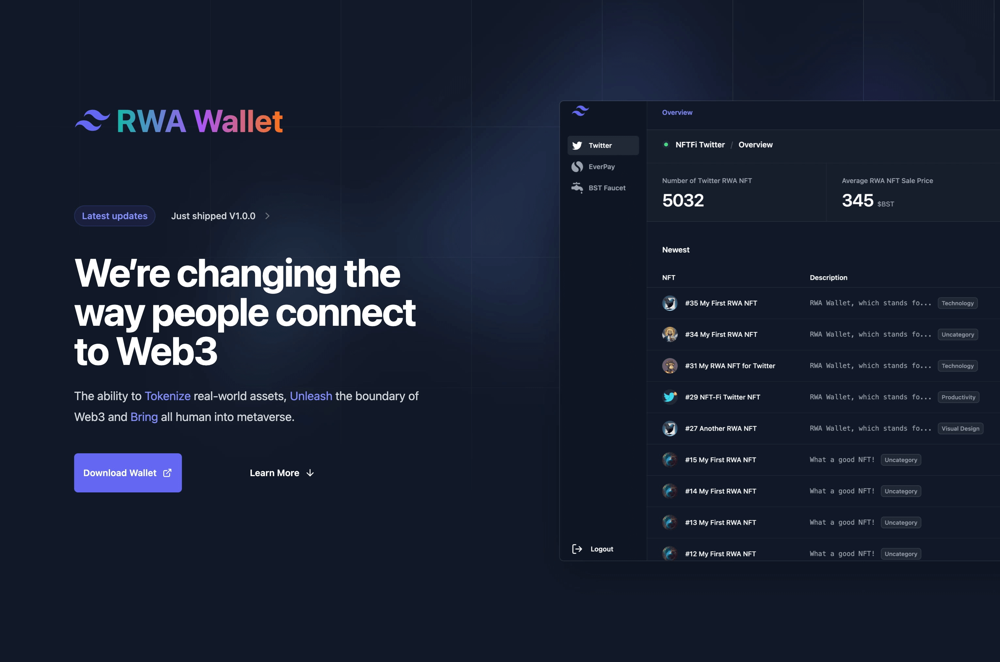
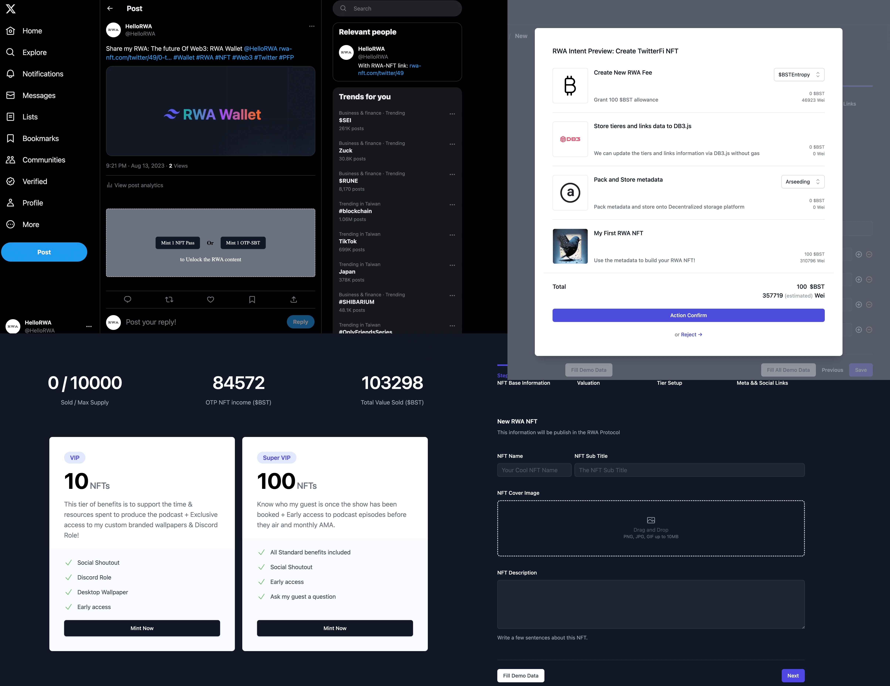
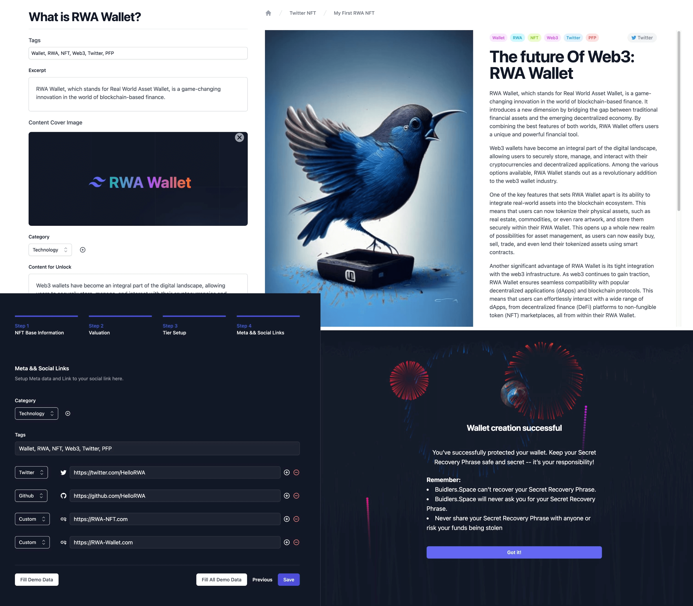

# TwitterFi NFT Factory

## Link

* [Website RWA-Wallet.com](https://RWA-Wallet.com)
* [Video Demo on Loom](https://www.loom.com/share/23050742280c400ba98258e47bce36df)
* [Download the beta wallet](https://download.rwa-wallet.com), pls install the chrome extension via [developer mode](https://bashvlas.com/blog/install-chrome-extension-in-developer-mode/)

## Contract deploy

* Optimism: <https://goerli-optimism.etherscan.io/address/0xd7f8fD88193BBd31beF70C52519A71F756F0F85C>
* Base: <https://goerli.basescan.org/address/0xf9982E648eE8F9E3e9039b0071bA939c3BC19652>
* Zora: <https://testnet.explorer.zora.energy/address/0x0c7274b6a23C8B257868cab80B991370ca6b06D7>

We try to deploy to Mode, but either use hardhad or remix, they all failed, only bridge to it works.

* Mode: <https://sepolia.explorer.mode.network/address/0xC6E58fb4aFFB6aB8A392b7CC23CD3feF74517F6C>

## Intro

TwitterFi NFT Factory is a decentralized social application built in the RWA Wallet Platform. It helps Twitter KoL to tokenize its social impact. 

Simply treat it as composed of Friend.tech + Unlock Protocol, and build in a Browser extension so it can inject specific blocks on the Twitter Web page.

## How it's Made

Our hackathon project is an innovative exploration of NFT and RWA technologies.

We've designed our platform to be user-friendly.

Content and Images are stored through IPFS / Arweave depending on the user's selection.

We use the super Arseeding and Everpay SDK that provide users to store content on the Arweave.

Our contracts are deployed on Optimism, Base, and Polygon Mumbai.

We have a plan to ensure these technologies' smooth implementation and integration. This project is an exciting opportunity to explore the potential of these technologies and we're eager to see how it evolves.

## Features

* Twitter Owner:
  * Create new NFT as the "shares" of the Twitter Account
    * RWA Wallet injects an "RWA NFT" button which other wallet users can click and see the TwitterFi NFT's Landing page.
    * Owner can update the Landing page's tiers, social link, etc. More features and themes will come soon!
  * Post new NFT-gating content on Twitter
    * Only users who own the TwitterFi NFT can unlock
    * RWA Wallet automatically generates a card with the link to jump to the content item detail page in the wallet
  * Create new OTP(One-time-payment) SBT as TwitterFi NFT income profit
  * All owners of the TwitterFi NFT get 10% of all OTP SBT income.
* Share traders(mint, buy, sell):
  * Can pay with ERC20 Token to mint the TwitterFi NFT Share
  * Auto unlock the NFT-gating content while holding the specific TwitterFi NFT share
  * [WIP] We are building an NFT trading module that traders can use inside RWA Wallet
* Readers (Who do not own the TwitterFi NFT share):
  * Can mint OTP SBT to unlock the NFT-gating content
* [WIP] Anyone can comment on other user's Twitter with NFT-Gating content(Gas Free but on Twitter only)
* [WIP] RWA-NFT.com for landing page the while user that not yet install the RWA-Wallet click on the RWA profile/item link

## Tech we use

* Wallet Application
  * [`TailwindCSS`](https://tailwindcss.com/) - A utility-first CSS framework
  * [`webextension-polyfill`](https://github.com/mozilla/webextension-polyfill) - WebExtension browser API Polyfill with types
  * [`webext-bridge`](https://github.com/antfu/webext-bridge) - effortlessly communication between contexts
  * [`unplugin-auto-import`](https://github.com/antfu/unplugin-auto-import) - Directly use `browser` and Vue Composition API without importing
  * [`unplugin-vue-components`](https://github.com/antfu/vite-plugin-components) - components auto import
  * [`unplugin-icons`](https://github.com/antfu/unplugin-icons) - icons as components
  * [Iconify](https://iconify.design) - use icons from any icon sets [🔍Icônes](https://icones.netlify.app/)
  * [VueUse](https://github.com/antfu/vueuse) - collection of useful composition APIs
  * [UnoCSS](https://github.com/unocss/unocss) - the instant on-demand Atomic CSS engine
  * [TypeScript](https://www.typescriptlang.org/)
  * [pnpm](https://pnpm.js.org/) - fast, disk space efficient package manager
  * [esno](https://github.com/antfu/esno) - TypeScript / ESNext node runtime powered by esbuild
  * [npm-run-all](https://github.com/mysticatea/npm-run-all) - Run multiple npm-scripts in parallel or sequential
  * [web-ext](https://github.com/mozilla/web-ext) - Streamlined experience for developing web ex
* RWA Protocol
  * [EIP20](https://eips.ethereum.org/EIPS/eip-20) - $BSTSwap and $BSTEntropy
  * [EIP1155](https://eips.ethereum.org/EIPS/eip-1155) - TwitterFi NFT creation
  * [EIP2535](https://eips.ethereum.org/EIPS/eip-2535) - Multi Fact Proxy for the contract
  * [EIP6551](https://eips.ethereum.org/EIPS/eip-6551) [WIP] - Make the TwitterFi NFT to be a Token Bound Account